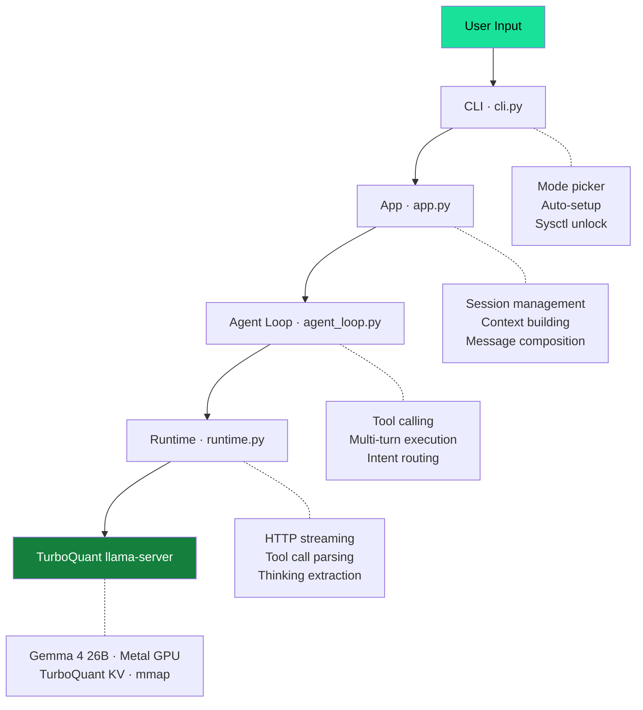
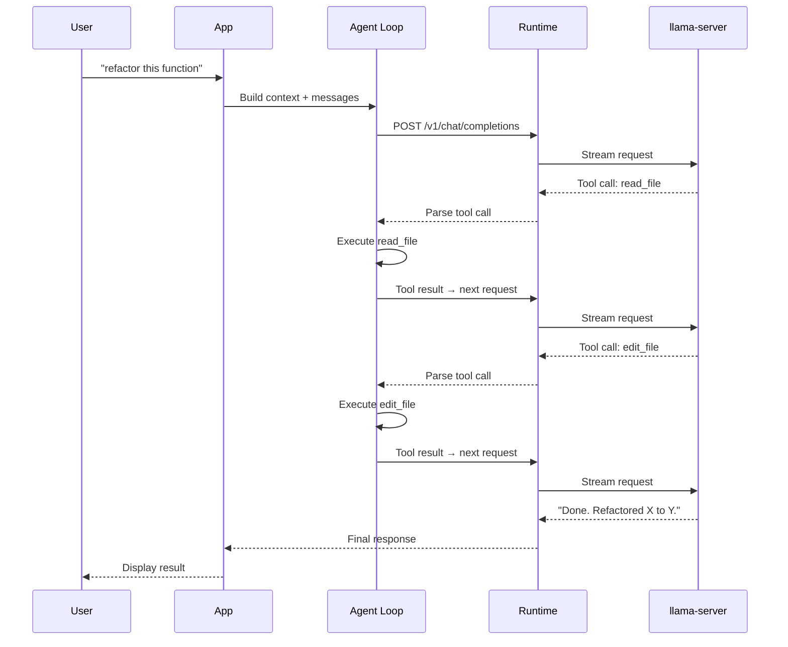
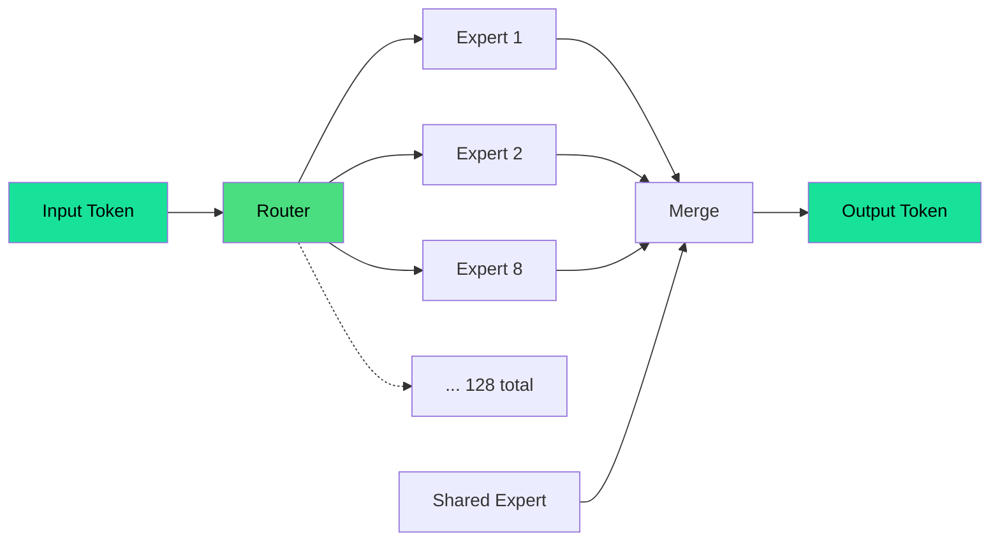
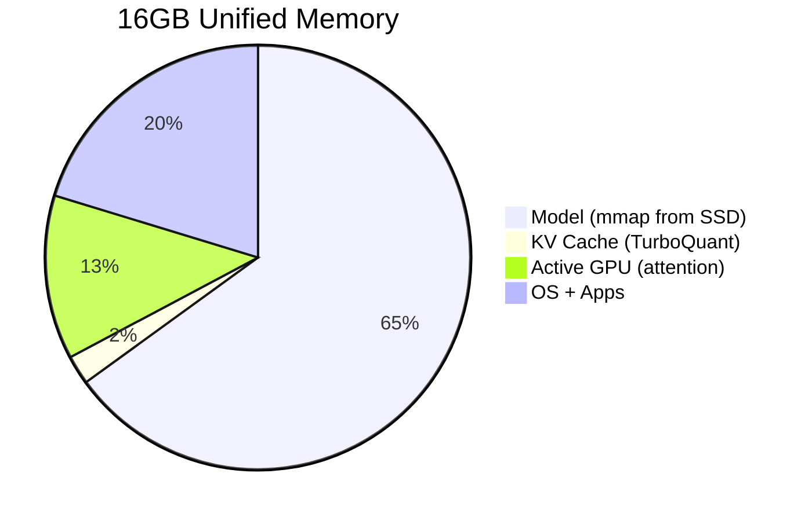
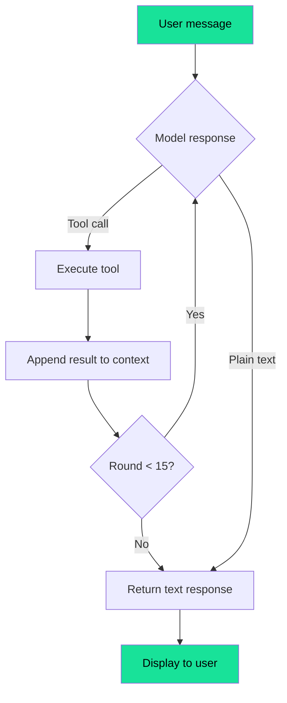

# Architecture

How LocalCode works under the hood.

## Overview



## Message flow



## The model

**Gemma 4 26B-A4B** — Google's Mixture-of-Experts model:



- 25.2B total parameters, **3.8B active** per token
- 128 experts, top-8 routing + 1 shared expert
- IQ3_S quantization (3.5 bits/weight, 10.4GB)
- 256K native context window

Only 3.8B params compute per token — speed of a 4B model, knowledge of a 25B model.

## Memory layout (16GB Mac)



## Inference server

A patched llama.cpp fork with:

- **TurboQuant KV cache**: `q8_0` keys + `turbo4` values → 3.8x compression
- **32K context** in 355 MiB (vs ~1.6GB without TurboQuant)
- **Full Metal GPU offload** via sysctl memory unlock
- **2 graph splits** (optimized MoE dispatch)
- **Native Gemma 4 tool parsing** (upstream cherry-picked)

## Tool loop



## File structure

```
localcode/
├── src/gem/
│   ├── cli.py              # Entry point, mode picker
│   ├── app.py              # Session management
│   ├── agent_loop.py       # Tool calling, execution
│   ├── runtime.py          # llama-server HTTP client
│   ├── composer.py         # Message composition
│   ├── context_manager.py  # System prompts, context
│   ├── toolkit.py          # Tool definitions
│   ├── output.py           # Terminal display
│   └── config.py           # Configuration
├── docs/                   # This documentation
└── tests/                  # Test suite
```

## Design decisions

| Decision | Why |
|----------|-----|
| Custom llama.cpp fork over Ollama | Ollama doesn't support TurboQuant — can't do 32K context on 16GB |
| Full GPU offload (`-ngl 999`) | 27 tok/s with 2 graph splits vs 18 tok/s CPU-only |
| Native tool calling over regex routing | Gemma 4 scores 85.5% on tool benchmarks — let the model decide |
| No hardcoded token budgets | Model generates until EOS (4096 safety net) |
| Thinking off for fast mode | IQ3_S thinking degenerates on simple prompts |

## What we tried and ruled out

| Approach | Result |
|----------|--------|
| MLX runtime | 4-bit model is 15GB — doesn't fit on 16GB without swap |
| Speculative decode | Slower for MoE (21.9 vs 27 tok/s) — active weights too small |
| Multi-token prediction | Gemma 4 not trained with MTP heads |
| Expert pruning (top-4) | Only 10% gain, quality risk |
| 128K context default | OOMs under memory pressure — 32K is stable |
