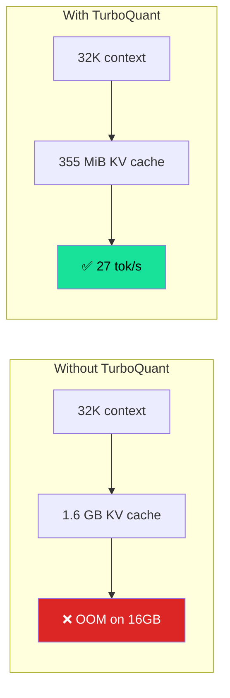
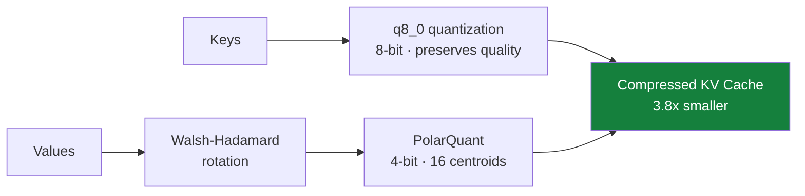

# Innovations

The engineering that makes LocalCode possible.

## TurboQuant KV Cache

The core innovation. We patched Google's [TurboQuant](https://arxiv.org/abs/2501.10208) (ICLR 2026) into llama.cpp for Apple Silicon Metal.



How it works:



- **Asymmetric compression**: `q8_0` keys (preserve quality) + `turbo4` values (3.8x compression)
- **PolarQuant**: 4-bit quantization with 16 optimal centroids
- **Walsh-Hadamard rotation**: Gaussianizes values for better quantization
- **Per-block norms**: preserves vector magnitude

!!! info
    This is the single biggest reason LocalCode works on a MacBook. Without it, you'd be limited to ~4K context on 16GB.

## GPU Memory Unlock

Apple Silicon limits GPU memory to ~11GB working set by default. Our 10.4GB model + KV cache exceeds this.

```mermaid
graph LR
    subgraph Default · 11GB limit
        D1[10.4GB model] --> D2[❌ No room for KV]
        D2 --> D3[CPU fallback\n18 tok/s]
    end
    subgraph After sysctl · 14GB limit
        S1[10.4GB model] --> S2[✅ 355 MiB KV fits]
        S2 --> S3[Full GPU\n27 tok/s]
    end

    style D3 fill:#dc2626,color:#fff
    style S3 fill:#18E299,color:#000
```

```bash
sudo sysctl iogpu.wired_limit_mb=14336
```

Raises the Metal working set to 14GB. Resets on reboot (safe).

## MoE Mmap + GPU

The 10.4GB model can't fit entirely in GPU memory alongside KV cache on 16GB. We use `--mmap` to memory-map the model from SSD.

macOS unified memory means the GPU reads directly from mmap'd pages. The MoE architecture only activates 3.8B of 25.2B params per token, so most expert weights stay cold on SSD. Only the active experts get paged in.

## Upstream Tool Calling Fix

The TurboQuant fork had outdated Gemma 4 chat parser files. We cherry-picked upstream fixes:

- `llama-vocab.cpp`: Gemma 4 BOS token fix
- `chat-peg-parser.cpp`: Updated tool call parsing
- `chat.cpp`: Updated template handling

**Result**: Native Gemma 4 tool calling works with TurboQuant.

## Prompt Cache Fix

TurboQuant's Walsh-Hadamard rotation causes KV cache corruption when the server's cross-request prompt cache is enabled. Fixed with `--cache-ram 0` — disables cross-request caching while keeping per-request KV cache (270ms TTFT after warmup).

## Performance summary

| Metric | Value |
|--------|-------|
| Decode speed | 24-27 tok/s |
| Time to first token | 220-270ms |
| Context window | 32K tokens |
| KV cache size | 355 MiB |
| Model size | 10.4GB (IQ3_S) |
| GPU memory | ~2GB active |
| Tool calling | Native Gemma 4 |
| Thinking mode | Working |

## Comparison

| | LocalCode | Ollama | Cloud API |
|--|-----------|--------|-----------|
| Speed | 24-27 tok/s | 28 tok/s | ~50 tok/s |
| Context | 32K | 4-8K | 128K+ |
| Tools | Native | Native | Native |
| Privacy | 100% local | 100% local | Cloud |
| Cost | $0 | $0 | $$/month |
| Offline | Yes | Yes | No |
