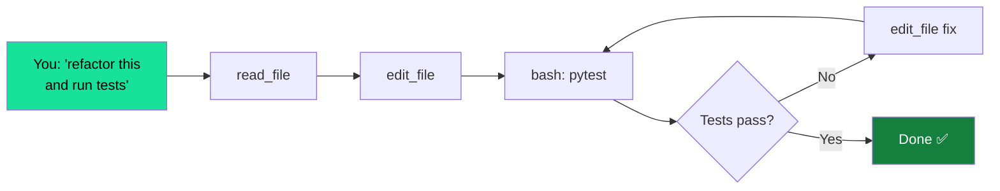

# Tools

LocalCode uses Gemma 4's native tool calling. The model decides when to call tools and which tool to use — you just ask for what you want.

## Available tools

| Tool | What it does | Example |
|------|-------------|---------|
| `read_file` | Read file contents | *"read pyproject.toml"* |
| `write_file` | Create or overwrite a file | *"create a hello.py script"* |
| `edit_file` | Surgical find-and-replace | *"change the port from 8080 to 8081"* |
| `bash` | Run shell commands | *"run the tests"* |
| `grep` | Search code by pattern | *"find all functions that return None"* |
| `glob` | Find files by pattern | *"list all .py files in src/"* |
| `web_search` | Search the web | *"look up pygame sprite docs"* |

## How it works

You don't call tools directly. You describe what you want, and the model picks the right tool:

```
You:   read the main config file and tell me what port it uses
Model: [calls read_file("src/config.py")] → reads the file
       The server is configured to run on port 8081.
```

```
You:   find everywhere we import requests
Model: [calls grep("import requests")] → searches codebase
       Found 3 files that import requests: ...
```

The model can chain multiple tool calls in a single task — read a file, understand it, edit it, then run tests to verify.

## Tool call format

Under the hood, Gemma 4 uses special tokens for tool calls:

```
<|tool_call>call:read_file{path:<|"|>pyproject.toml<|"|>}<tool_call|>
```

The llama-server parses these natively. You never see them — the app handles the round-trip automatically.

!!! info "Reliability"
    Gemma 4 26B scores **85.5%** on tau2-bench (tool calling benchmark). At IQ3_S quantization, tool calling works reliably for direct requests. Complex multi-tool chains may occasionally need a nudge.

## Multi-turn tool loops

For complex tasks, the model runs a tool loop:



Up to 15 rounds per task. The model reads, edits, runs tests, and fixes issues on its own.

## Permissions

By default, the model asks before running destructive commands. See [Permissions](permissions.md) for details.
